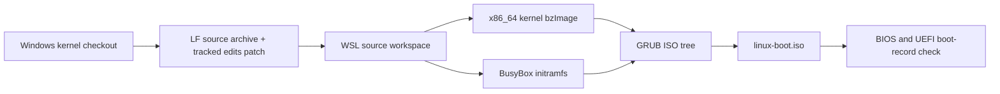

# How the ISO build works

Run `build-iso.ps1` from PowerShell to build `linux-boot.iso` in the repository root. PowerShell coordinates the Windows checkout and WSL; the kernel and ISO tools run inside the selected WSL distribution.

```powershell
.\build-iso.ps1
```

The script accepts two optional parameters:

```powershell
.\build-iso.ps1 -Distro Ubuntu -Jobs 6
```

`Distro` selects the installed WSL distribution (default `Ubuntu`). `Jobs` sets the number of parallel kernel build jobs (default `6`).

## Build sequence

1. **Check the Windows-side prerequisites.** The script confirms the Linux submodule directory exists and that `git.exe` and `wsl.exe` are available.
2. **Stage the kernel source.** It exports the submodule's committed files with `git archive`, with Git's automatic line-ending conversion disabled. It also saves the tracked changes relative to `HEAD` as a binary patch. This avoids compiling directly from a Windows checkout whose line endings may confuse Linux Kconfig tools. Untracked files in the kernel submodule are not included.
3. **Prepare a separate build workspace in WSL.** The Bash build script runs under the selected distribution. It checks for the compiler, kernel build utilities, static BusyBox, GRUB, and ISO creation tools. If something is missing, it prints the Ubuntu package install command and stops.
4. **Recreate the working source tree.** The source archive is extracted under a timestamped directory in the WSL user's home folder. The saved tracked-change patch is checked and applied there, so the build uses the committed kernel plus the local tracked edits.
5. **Configure and compile the kernel.** `x86_64_defconfig` creates a standard x86_64 configuration. `make ... bzImage` builds the bootable kernel image, using the separate `obj` directory for generated files.
6. **Create a small initramfs.** The script copies in statically linked BusyBox, writes an `/init` startup script, and creates the required device nodes and BusyBox command links. On boot, `/init` mounts proc, sysfs, and devtmpfs, then opens a BusyBox shell.
7. **Assemble the bootable ISO.** The kernel and compressed initramfs are placed in a GRUB directory tree. GRUB's menu loads the kernel with `rdinit=/init` and then loads the initramfs. `grub-mkrescue` writes the ISO at the repository root.
8. **Check BIOS and UEFI boot entries.** The script checks the GRUB configuration and examines the ISO's El Torito boot records. It reports an error if either BIOS or UEFI boot support is missing.
9. **Remove Windows-side staging files.** The temporary source archive, patch, and generated Bash script are deleted even if the build fails. The WSL build workspace remains under the WSL user's home directory; the finished ISO remains at the repository root.



## What the ISO contains

This is a bootable kernel test image, not a full Linux distribution. It contains the compiled kernel, a minimal initramfs, static BusyBox utilities, and GRUB. A successful boot displays a shell; type `poweroff` to shut down.

The main generated artifact is:

```text
linux-boot.iso
```

The kernel object files and intermediate initramfs/ISO tree are kept in a timestamped `~/linux-boot-build-*` directory inside WSL. They are separate from the Windows source checkout and can be removed from Ubuntu when no longer needed.
